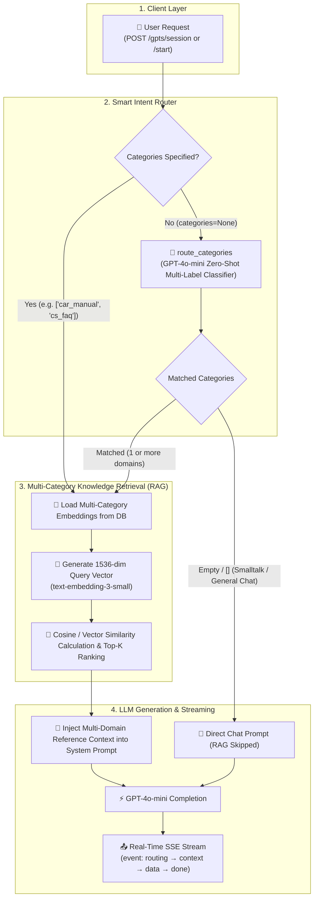

# 🤖 GPTS App - Multi-Category RAG & Smart Auto-Routing Architecture

The `gpts` Django app provides an intelligent, production-ready AI chat service featuring **multi-category scoped Retrieval-Augmented Generation (RAG)**, **intent-based multi-domain auto-routing**, and **real-time Server-Sent Events (SSE) streaming**.

## 🏗️ Architecture & Pipeline Flowchart

When a user submits a question without specifying categories (`categories=None`), the system leverages a lightweight router classifier (`GPT-4o-mini`, `temperature=0.0`) to dynamically resolve single or multiple relevant categories from active categories in the database before vector retrieval.



---

## 🔑 Core Features & Modules

### 1. Dynamic Knowledge Schema (`models.py`)
- **`GPTEmbeddingCategory`**: Defines knowledge domain boundaries (e.g., `car_manual`, `cs_faq`, `service_guide`) and specifies the default `embedding_model` per category.
- **`GPTEmbedding`**: Stores pre-computed vector embeddings (1536 dimensions for `text-embedding-3-small`) linked to categories.
- **`GPTChatRoom` & `GPTChatMessage`**: Manages persistent conversation history with auto-generated room titles and token-based conversation summarization.

### 2. Math & Similarity Engine (`utils.py: SimilarityEngine`)
- **Cosine Similarity**: `(u · v) / (||u|| * ||v||)` (Default)
- **Dot Product**: `sum(u_i * v_i)`
- **Euclidean Similarity**: `1 / (1 + ||u - v||)`
- **Manhattan Similarity**: `1 / (1 + sum(|u_i - v_i|))`

### 3. Smart Multi-Category Router (`utils.py: GPTEmbeddingService.route_categories`)
- Dynamically queries all active `GPTEmbeddingCategory` records and their descriptions from `db.sqlite3`.
- Calls `gpt-4o-mini` with `temperature=0.0` to classify query intent into zero, one, or multiple categories simultaneously.
- **Multi-turn Context Awareness**: In chat rooms, incorporates conversation history/summary into the router and search query so pronouns (e.g., "my car") resolve to previously mentioned entities (e.g., "Avante 2024").
- Automatically skips RAG embedding retrieval for small talk and generic questions, avoiding unnecessary embedding API costs and latency.

### 4. Real-time SSE Stream Generator (`utils.py: GPTService`, `GPTSessionService`)
- Emits transparent lifecycle events (`event: init`, `event: routing`, `event: context`, `data: <token>`, `event: meta`, `event: done`).
- Auto-saves streamed responses to the database in chunks (`STREAM_SAVE_EVERY = 20`) to preserve message state during disconnects.

---

## 📡 SSE Streaming Protocol Specification

| Event Name | Sample Payload (`data`) | Description |
| :--- | :--- | :--- |
| `event: init` | `{"room_id": 1}` | *(Chat room creation)* Emits new chat room ID. |
| `event: routing` | `{"is_routed": true, "categories": ["car_manual", "cs_faq"], "was_auto_routed": true}` | **Real-time decision transparency**: matched categories & RAG flag. |
| `event: context` | `{"categories": ["car_manual", "cs_faq"], "relevant_contexts": [...], "algorithm": "cosine"}` | Matched multi-domain reference knowledge documents with similarity scores. |
| `data: <token>` | `Avante`, ` 2024`, ` fuel`, ` economy` ... | Raw UTF-8 token streamed from GPT model. |
| `event: meta` | `{"room_id": 1, "room_name": "Avante Specifications", ...}` | *(First message)* AI-generated short room title. |
| `event: done` | `{"assistant_id": 2}` or `end` | Completion indicator. |

---

## 🚀 API Endpoints

All endpoints require `Authorization: Bearer <JWT_ACCESS_TOKEN>` header and return `Content-Type: text/event-stream`.

### 1. Start Chat Room (`POST /gpts/start`)
Creates a new persistent room, routes categories, injects knowledge, generates title, and streams response.
```json
{
  "message": "What is the fuel efficiency of Avante and what is the refund policy?",
  "model": "gpt-4o-mini",
  "use_embedding": true,
  "embedding_algorithm": "cosine",
  "categories": ["car_manual", "cs_faq"],
  "top_k": 5
}
```

### 2. Send Chat Room Message (`POST /gpts/chatrooms/<int:id>/messages`)
Sends a message to an existing room, maintains history context, and streams assistant response.
```json
{
  "message": "How do I turn on Smart Cruise Control?",
  "model": "gpt-4o-mini"
}
```

### 3. Ephemeral Session Chat (`POST /gpts/session`)
Stateless, one-off Q&A session supporting automatic knowledge routing without creating room records.
```json
{
  "message": "Within how many days can I request a refund?",
  "model": "gpt-4o-mini"
}
```

---

## 🛠️ Management Commands

### Seed Knowledge Base Embeddings
Populate domain knowledge and pre-compute OpenAI vectors:
```bash
# Clean seed knowledge base
python manage.py seed_embeddings --clear

# Populate only un-embedded records in DB
python manage.py seed_embeddings --populate-only
```
